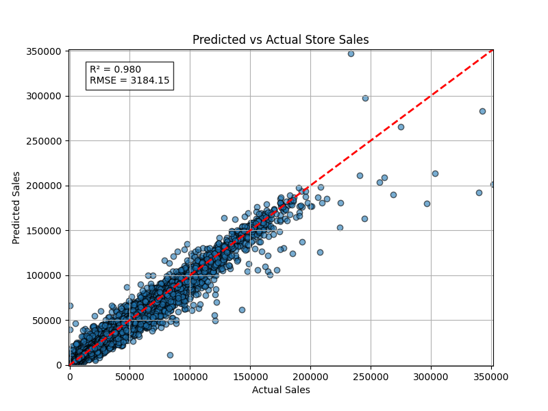

# Walmart-Stores-Sales-Forecast
Kaggle's Walmart challenge: Modelling weekly sales. In this notebook, we use data from Walmart to forecast their store's weekly sales.

### Overview
The purpose of the project is to forecast sales for Walmart's product categories in their store based on the sales history of each category. Historical sales data for 45 Walmart stores located in different regions is provided. Each store contains a number of departments.  The goal is to build a predictive model that can accurately predict department-wide weekly sales for each store.

Walmart runs several promotional markdown events throughout the year. These markdowns precede prominent holidays, the four largest of which are the Super Bowl, Labor Day, Thanksgiving, and Christmas. The weeks including these holidays are weighted five times higher in the evaluation than non-holiday weeks. Model the effects of markdowns on these holiday weeks in the absence of complete/ideal historical data.

This project applies regression model techniques. Evaluation is based on RMSE values for the test set.

### Project Structure
project-name/ Walmart Store's Sales Forecast

├── Datasets

├── Notebooks for exploration

├── src

├── Results Plots and Evaluation results

└── README.md   

### Dataset
Dataset source:  

Dataset consists of 5 files stores.csv, features.csv, train.csv, test.csv
Features include:
  1. Temperature - average temperature in the region
  2. Fuel_Price - cost of fuel in the region
  3. MarkDown1-5 - anonymized data related to promotional markdowns that Walmart is running. MarkDown data is only available after Nov 2011, and is not available for all stores all the time. Any missing value is marked with an NA.
  4. CPI - the consumer price index
  5. Unemployment - the unemployment rate
  6. IsHoliday - whether the week is a special holiday week

Target variable: Weekly_Sales (sales for the given department in the given store)
Target Submission File:
For each row in the test set (store + department + date triplet), predict the weekly sales of that department. The Id column is formed by concatenating the Store, Dept, and Date with underscores (e.g. Store_Dept_2012-11-02).   

### Data Clean up approach:
Fill all missing values with zero.
### Feature engineering:
1. Convert Date Columns to Date, Week, Month
2. Calculate # of days to Christmas for each week & # of days to Thanksgiving for each week
3. Mark the long weekends & it's week as "1" based on the week it occurs in a year. For e.g., Thanksgiving is on 47th week, SuperBowl on 6th week, and LaborDay on 36th week

### Target variable - Sales Data Analysis
1. Obervation: Sales remain relatively stable throughout the year, except a dip around week 42 and a subsequent resurgence during the holiday season
2. Observation: Markdowns (MDs) play a significant role in boosting sales during the beginning and end of the year
3. Observation: Negative Correlation exists between Temperature and Sales
4. Observation: No clear Correlation exists between Fuel price and Sales as it goes down and up
5. Obervation : As the unemployment rate increases Sales decreases
6. Obervation : As the Store size increases Sales increases
7. Obervation on Store Type:  Store type "C" contributes to sales though their number is less
8. Correlation BAR Chart: Display Store, Dept are positively related and CPI & Unemployment are negatively related with Weekly_sales
    
### Identification of Features making the impact
Select Features that impacts Weekly  Sales using:
1. feature_importances_ (XGBoost built-in function)
2. Permutation Importance (ELI5)

### Modeling - Used below Regressor Models for Prediction
1. LGBM
2. XGB
3. CatBoost
4. HistGradientBoosting
5. ExtraTrees
6. RandomForest

### Evaluation Metrics:
LGBM RMSE    : 6712.4683
XGBoost RMSE : 5233.9659
Catboost RMSE: 5354.7629
HGBR RMSE    : 6677.4183
ExtraTr RMSE : 3184.1464
RandomF RMSE : 3796.6128

Normalised RMSE using ExtraTr : 26.2

### Prediction vs Actual Sales:

https://github.com/jaidatta71/Walmart-Store-s-Sales-Forecast/blob/main/Results%20Plots%20and%20Evaluation%20results/predicted_vs_Actuals.png

### Residual Plot:
https://github.com/jaidatta71/Walmart-Store-s-Sales-Forecast/blob/main/Results%20Plots%20and%20Evaluation%20results/residual_plots.png
